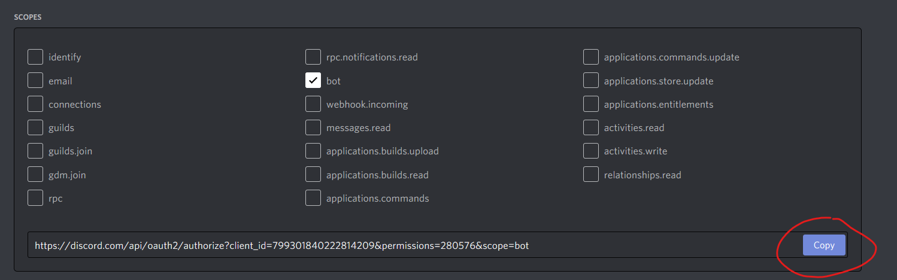

# Cool-bot

This is the open source release for my my AI(ish) bot (the old repo sucked)

## Setup

There is still some setup required, however it is far less, and better explained

First thing you're gonna want to do is head to the [discord developer portal](https://discord.com/developers/applications) and create a new Application

After sucessfully creating a new application you will want to go to the bot tab on the left

You will now want to click on "Add bot"

After that, copy the token and put it in the token.txt file, just put it in there you do not need quotation marks or anything

<<<<<<< HEAD
Something to note: the bot may need iresence intent and server member intent as it does log every message sent, so you may need to enable those.
=======
Something to note: the bot may need presence intent and server member intent as it does log every message send, so you may need to enable those.
>>>>>>> 54a94f50f16211159ae62055ac645d053ba3c34b

Now you will need to add the bot to your server. to do such, go to the OAuth2 tab.

Once there, select "bot" as scope

For the bot permissions tab, you can put anything you want. just make sure that the bot can send messages (I do recomend enabling embed links and external emojis aswell)

Once you do that, copy the link at the bottom of the scope selecter and paste it in a new tab

From there it's just like adding any other bot to a server, selcect the server you want to add it to and configure the perms. (you will need manage server permission to add bots)

### Running the bot
**This part is windows only, but the steps for other operating systems should be similar**

There are several methods to run the bot, some will require you to download software on your computer.

**__First Method:__**

The first method is running it locally, I personaly recomend this method but some people will not want to isntall python

To run the bot locally, you can just double click the file in file explorer (this will REQUIRE [python](https://www.python.org/downloads))

However, this won't be useful if errors show up and it won't tell you how to fix them, so I recomend dowloading [Visual Studio Code](https://code.visualstudio.com/Download)

This will allow high level code editing and will tell you if any errors happen. To run code in visual studio code, find the terminal button at the top and scroll down the "Run in terminal" (This will still REQUIRE [python](https://www.python.org/downloads))

There are still some more things you will need to do in order to run the bot, which is install some packages. Without installing these packages, python will not know what "discord" is and the entire bot will not work

To install a package, you will want to open up a new command prompt. to open command prompt, search "cmd" in windows start menu

Once in a command prompt, run the command `pip install discord` and wait for it to install.

After that, run the command `pip install datetime`

Once done installing these packages, the bot should be good to go!

**__Second Method:__**

If you're not confortable with installing python, you can always copy the repository to a [repl](https://repl.it)

repl is entirely web based, so nothing is done to your pc

First thing you want to do it make a new repl, which you can find the button to do so in the top right.

After that, you will want to chose the import from GitHub option

Copy the link of [this repository](https://github.com/deb06/Cool-bot) and put it in the repositoy URL and click "Import"

This should copy all the files, and if it doesn't you may have to clone the repository onto your account and then link your GitHub to repl

Next, you will want to add a package. to add packages, simply go to the packages tab on the left.

Install the package "discord.py" 

Hit the "run" button and everything should be good!
